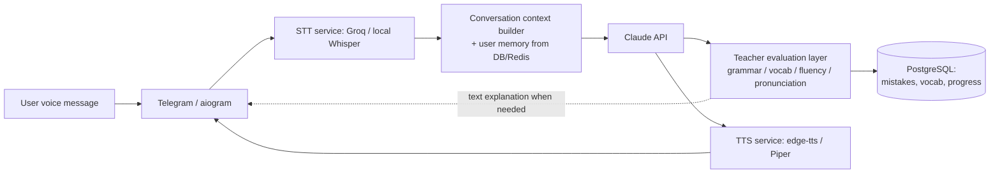

# English Tutor Bot — Architecture & Implementation Plan

Status: **DRAFT — awaiting approval before any source code is written.**

This document is the single approval gate for the project, per the spec's own
closing requirement: architecture, DB schema, folder tree, API flow, roadmap
and implementation plan first — code only after sign-off, then module by
module.

---

## 1. Decisions that need your explicit approval

These are the points where the original spec's stack collides with reality on
this machine or with your "free + natural voice" requirement. Everything else
in this doc follows from the choice made here.

### 1.1 STT/TTS engine (conflicts with the original spec)

The original prompt specifies **Faster-Whisper + Piper TTS** (both local,
offline, free). You then asked for "free AND natural-sounding." Piper is
free but noticeably robotic — that's a direct conflict, not a detail.

Recommended:

| Layer | Primary | Why | Fallback |
|---|---|---|---|
| STT | **Groq API** (`whisper-large-v3-turbo`) | Free tier = 2,000 requests/day, cloud-fast (sub-second), high accuracy. Needs a free Groq account + API key. | Faster-Whisper, local — see 1.2 |
| TTS | **edge-tts** | Free, no API key, uses Microsoft Edge's neural voices — genuinely natural, supports RU/EN/ZH multi-language (matches your translator requirement). Unofficial client against an undocumented endpoint — could break or get rate-limited without notice. | Piper TTS, local, fully offline |

This means: natural voice by default, degrades to robotic-but-always-available
Piper only if you're offline or Groq/edge-tts are unreachable. If you'd
rather stay 100% offline/local per the letter of the original spec (accepting
the more robotic voice), say so and I'll flip the priority.

### 1.2 Python version (blocks local Whisper entirely if unaddressed)

This machine has **Python 3.13.14** only. `ctranslate2` (Faster-Whisper's
dependency) currently ships **no Windows wheels for Python 3.13** — it will
fail to install as-is. To keep the local-Whisper fallback option alive at
all, the project needs its own **Python 3.12** virtual environment,
independent of system Python.

→ I'll install Python 3.12 via `winget` and create the project venv on it,
unless you'd rather I use system 3.13 and simply drop local Whisper (Groq-only
STT, no offline fallback). Confirm which.

### 1.3 GitHub repo connection

`github.com/abat6569` exists, 0 public repos — `english-tutor-bot` doesn't
exist yet. This machine has no `gh` CLI and no SSH key configured, so I
cannot create/push to your GitHub myself yet. Two options:

- **A** — you create an empty repo at `github.com/abat6569/english-tutor-bot`
  in the browser, I add it as `origin` and push over HTTPS (a browser login
  popup will appear on the first push via Git Credential Manager).
- **B** — I generate an SSH keypair locally, you paste the public key into
  GitHub → Settings → SSH keys, then all pushes are silent.

### 1.4 Claude API cost (unanswered so far, flagging again)

This bot's core loop is a Claude call on every voice turn, daily. That's a
real, ongoing cost on your Anthropic account — not free. I need you to have
an API key ready before Phase 1 is testable, and it's worth deciding a rough
monthly budget/model tier (e.g. Haiku for cheap high-frequency turns, Sonnet
for evaluation/lesson-generation) before we wire it in.

### 1.5 Tooling gaps on this machine (informational, not blocking doc approval)

- **Docker**: not installed. I'll write `Dockerfile`/`docker-compose.yml` in
  Phase 0, but can't run/test them locally until Docker Desktop is installed.
- **Hosting**: Oracle Cloud Always-Free tier as specified in the original
  prompt — needs your own OCI account, only relevant at Phase 10 (deployment).

---

## 2. Finalized tech stack

| Concern | Choice |
|---|---|
| Language | Python 3.12 (dedicated project venv) |
| Bot framework | aiogram 3 |
| LLM | Claude API (Anthropic) — model split TBD per 1.4 |
| STT | Groq Whisper API (primary) / Faster-Whisper local (fallback) |
| TTS | edge-tts (primary) / Piper (fallback) |
| DB | PostgreSQL + SQLAlchemy (async) + Alembic migrations |
| Cache/session state | Redis |
| Scheduler | APScheduler (reminders, adaptive daily lesson generation) |
| Admin panel | FastAPI (separate small service, reads same DB) |
| Packaging | Docker + docker-compose |
| CI | GitHub Actions (lint, type-check, tests) |
| Lint/format/type | Ruff, Black, Mypy |
| Tests | Pytest (unit/integration/e2e) |
| Deployment target | Oracle Cloud Always-Free tier |

---

## 3. High-level flow



Text is used only where voice is a poor fit: grammar explanations, vocab
lists, homework, stats, settings — matching the original spec.

---

## 4. Folder structure

```
english-tutor-bot/
├── src/
│   ├── bot/                     # Telegram layer (aiogram) — thin, no business logic
│   │   ├── handlers/            # one file per command/feature (lesson, speaking, interview, translator, admin...)
│   │   ├── middlewares/         # auth, logging, rate-limit, error handling
│   │   ├── keyboards/
│   │   └── states/              # aiogram FSM states per conversation flow
│   ├── core/                    # domain layer — framework-agnostic
│   │   ├── entities/            # dataclasses: User, LessonSession, Mistake, VocabItem...
│   │   ├── interfaces/          # abstract Protocols: STTProvider, TTSProvider, LLMProvider, Repository[T]
│   │   └── use_cases/           # orchestration: RunSpeakingTurn, GenerateDailyLesson, ScoreInterviewAnswer...
│   ├── services/                # implementations of use-case logic
│   │   ├── ai/                  # Claude client, prompt templates, response parsing
│   │   ├── voice/               # STT/TTS orchestration, audio format handling
│   │   ├── learning/            # lesson generation, adaptive-difficulty engine
│   │   ├── interview/           # question banks, scoring, retry loop
│   │   ├── translator/          # text/voice/document/image translation
│   │   ├── gamification/        # XP, streaks, achievements
│   │   └── reminders/           # scheduling logic
│   ├── infrastructure/
│   │   ├── db/
│   │   │   ├── models/          # SQLAlchemy ORM models
│   │   │   └── repositories/    # concrete repository implementations
│   │   ├── cache/               # Redis client wrapper
│   │   ├── stt/                 # GroqSTT, LocalWhisperSTT adapters
│   │   ├── tts/                 # EdgeTTS, PiperTTS adapters
│   │   └── external/            # OCR client, file storage, etc.
│   ├── admin/                   # FastAPI admin panel app
│   ├── config/                  # pydantic-settings, env loading, constants
│   └── utils/
├── alembic/                     # DB migrations
├── tests/
│   ├── unit/
│   ├── integration/
│   └── e2e/
├── docs/
│   ├── ARCHITECTURE.md          # this file
│   ├── DEPLOYMENT.md
│   └── INSTALL.md
├── docker/
│   ├── Dockerfile
│   └── docker-compose.yml
├── .github/workflows/ci.yml
├── scripts/                     # backup.py, seed_vocab.py, etc.
├── .env.example
├── pyproject.toml
├── README.md
└── main.py
```

---

## 5. Database schema (core tables)

- **users** — telegram_id (PK), username, native_language, current_level,
  target_level, timezone, settings_json, created_at, last_active_at
- **lessons** — id, user_id FK, type (speaking/professional/interview/
  translator), topic, started_at, ended_at, summary, xp_earned
- **messages** — id, lesson_id FK, role, content_text, audio_path,
  transcribed_text, created_at
- **mistakes** — id, user_id FK, lesson_id FK, category (grammar/vocabulary/
  pronunciation/fluency), original_text, corrected_text, explanation,
  severity, created_at
- **vocabulary** — id, user_id FK, word, translation, definition,
  example_sentence, mastery_level, times_seen, times_correct, next_review_at
  (spaced repetition)
- **grammar_topics** — id, user_id FK, topic_name, mastery_level,
  times_practiced, last_practiced_at
- **interview_sessions** — id, user_id FK, interview_type, questions_json,
  answers_json, score, feedback, created_at
- **translations** — id, user_id FK, source_lang, target_lang, source_text,
  translated_text, mode, created_at
- **progress_stats** — id, user_id FK, date, xp_earned, minutes_spoken,
  new_words_learned, mistakes_corrected, streak_day
- **achievements** — id, user_id FK, achievement_code, unlocked_at
- **reminders** — id, user_id FK, reminder_type, scheduled_time, is_active
- **api_usage** — id, user_id FK, service, units_used, cost_estimate,
  created_at (needed to actually track the Claude cost from 1.4)
- **admin_logs** — id, event_type, payload_json, created_at

Full column types/constraints go in the Alembic migration, not here.

---

## 6. Roadmap — module by module

Each phase ends in something you can actually use, per your instruction to
build per the prompt as written (full scope, staged delivery — not a
stripped MVP).

| Phase | Module | Deliverable |
|---|---|---|
| 0 | Foundations | Repo scaffold, config layer, DB schema + Alembic, Docker skeleton, CI skeleton, `/start` `/help` |
| 1 | Core voice loop | STT → Claude → TTS working end to end; conversation memory (last N turns); messages persisted |
| 2 | Teacher evaluation | Grammar/vocab/fluency/pronunciation scoring after each turn; mistake logging; corrected-sentence playback |
| 3 | Memory & adaptive learning | Mistakes/vocab/grammar persisted across sessions; tomorrow's lesson auto-built from today's errors |
| 4 | Professional English mode | QA/QC domain topic bank + role-play personas (EPC contractor, inspector, client) |
| 5 | Interview mode | Structured question sets, scoring, iterative re-ask until answer is natural |
| 6 | Translator mode | Text/voice/document/image-OCR translation across RU/EN/ZH/UZ |
| 7 | Gamification & stats | XP, levels, streaks, achievements, `/progress` dashboard |
| 8 | Notifications | APScheduler daily/weekly/monthly reminders |
| 9 | Admin panel | FastAPI panel: logs, analytics, token/API cost usage, DB monitoring |
| 10 | Hardening & deployment | Full docker-compose, GitHub Actions CI, Oracle Cloud deploy guide, backups |

---

## 7. Open items before Phase 0 can start

1. Approve or override the STT/TTS decision (§1.1)
2. Approve Python 3.12 dedicated venv, or accept Groq-only STT on 3.13 (§1.2)
3. Pick GitHub connection method A or B (§1.3)
4. Have an Anthropic API key ready, and a rough monthly budget in mind (§1.4)
5. (Not blocking) Install Docker Desktop whenever you want local
   docker-compose testing to work
